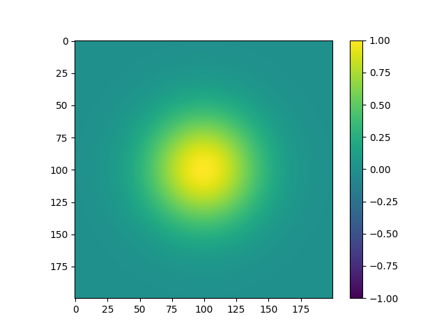
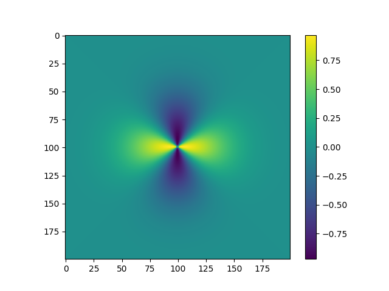
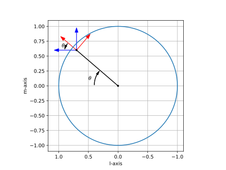
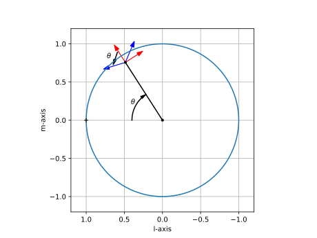
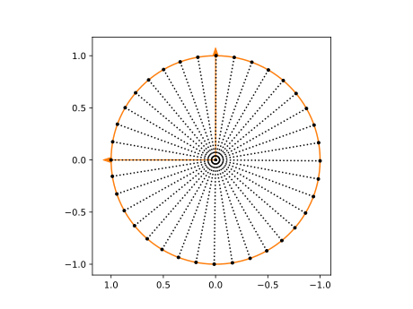
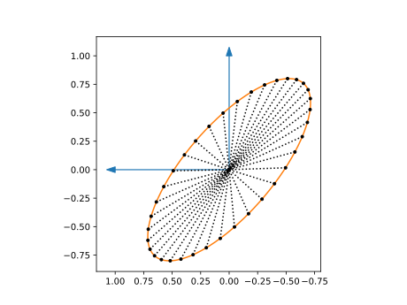

# Polarization Coordinate Frames

The resolution on polarization definitions of the IAU 1973 General Assembly states "that the frame of reference for the Stokes parameters is that of Right Ascension and Declination with the position angle of electric vector maximum, $\theta$, starting from North and increasing through East" 
(page 21 of https://www.iau.org/static/resolutions/IAU1973_French.pdf).
As explained below this definition causes difficulties when making images close to the north or south celestial pole.

## Map of the Problematique

Consider some diffuse polarized emission at the North Celestial Pole (NCP).
When this source is observed by a dish telescope with equatorial mount, and this observation is calibrated for a single direction, and imaged, then the resulting Stokes Q image will look something like this:



There will be some changes in the response over the field of view, but these are small, so even without direction dependent corrections the image will look reasonable.

When this source is observed by a fixed on the ground phased array like LOFAR, the beam shape and element response change over the observation. The orientation of the dipoles and the sky change with respect to eachother. This will cause depolarization. Therefore a correction for the instrument response needs to be applied. Because the beam shape changes over time this needs to be a direction dependent correction.
The correction is in the form of a Jones matrix. The Jones matrix describes the relation between the input signal, the electromagnetic field, and the output signal, the voltages at the terminals of the two dipoles. The input electromagnatic field is a vector field and has therefore an orientation. EveryBeam adheres to the IAU polarization definition for the reference directions it uses for the computation of the Jones matrices.

When applying this direction dependent correction for the full Jones beam as currently computed by EveryBeam in the imaging step, this choice of reference direction has a curious effect on polarized sources. If the facets are choosen small enough, or the resolution of the A-term high enough, a diffuse polarized source at the NCP will look something like this:



The blob has turned into a bowtie!

Technically the image is correct. If the polarization of the source is more or less constant, but the reference frame rotates as function of position in the image, then the image should display quickly rotating polarization.

However, images like these are both hard to create and hard to interpret.
Even for dish based telescopes with equatorial mounts, a direction dependent rotation needs to be applied to create the bow-tie.

A more convenient choice of reference would result in images that resemble the first image. The direction dependent correction then only corrects for smaller deviations from the nominal response.

Although this is more in line with the way images for dish based telescopes are made, image processing software for source finding and mosaicing seem to expect images strictly adhering the IAU polarization convention and to ignore the problematic corner cases.

## Solution Outline

To fix this problem the polarization coordinate frame should be kept in the same direction over the image. Because an image is a projection from a sphere onto a plane this 'same direction' needs to be defined with some care.

The change should only affect imaging. For a catalog of sky sources the polarization coordinate frame should simply match the RA dec system, and hence be independent from the image this source was extracted from. That also means that the source extractor needs to make the translation from the polarization coordinate frame for the image, to the local frame at the source position.

* Sky model - constant over extent of Gaussian

* Mosaicing - images should already be converted to the target polarization frame.
Ideally the images should not contain a pole/discontinuity, because they are resampled.
* Source extraction. There should be no poles in the image.


## How polarization frame rotations are currently implemented in EveryBeam
Directions in EveryBeam are computed in ITRF coordinates.
A pointing given in RA and dec is converted to an ITRF vector.
The orientation associated to this the pointing is given by two other ITRF vectors, 'north' pointing in the direction of the NCP, and 'east' pointing in the direction of increasing RA.
The ElementResponse uses a local east-north-up coordinate system. The polarization orientation used here are the theta and phi directions.
To convert the Jones matrix of the ElementReponse oriented in local coordinates, to a Jones matrix oriented in sky coordinates, it is multiplied by a 2x2 rotation matrix, computed from the inner products between the two sets of orientation vectors:

```math
  \mathbf{J}_{xy} = \mathbf{J}_{\theta\phi}
  \left[
    \begin{array}{c}
    - \mathbf{v}_{\theta}^\mathrm{T} - \\ 
    - \mathbf{v}_{\phi}^\mathrm{T} - 
    \end{array}
  \right]
  \left[
    \begin{array}{cc}
    | & | \\
    \mathbf{x} & \mathbf{y} \\
    | & |
    \end{array}
  \right]
```
Because all vectors lie in the same tangent plane and the two vectors in a set are orthogonal to eachother, the transformation is always just a pure rotations, i.e. the transformation matrix is a 2x2 unitary matrix.


## Initially Proposed Change - dl, dm at the image centre (beamformer phase centre)

The initially proposed change to fix the polarization orientation in an image is to use the orientation vectors ('north' and 'east') at the image centre for the entire image.
The problem with that is that away from the image centre these vectors are not orthogonal to the looking direction.
For small fields of view the effect is negligible.
For wide field imaging this becomes a problem. For example for a source $8\degree$ away from the centre, this can lead to a leakage of 1\% Stokes I flux into polarized flux.
The polarized fraction is usually just a few percent, so this leakage is significant. 
(http://www.gmrt.ncra.tifr.res.in/doc/WEBLF/LFRA/node134.html)

For LOFAR fields the leakage might still be acceptable, but SKA LOW the fields will be even larger.

## Imaging coordinates

An image is created for a pointing vector $\mathbf{p}$. The orientation of the image is given by vectors $\mathbf{l}(\mathbf{p})$ and $\mathbf{m}(\mathbf{p})$  
where $\mathbf{l}(\mathbf{p})$ points in the direction of increasing RA (east) and $\mathbf{m}(\mathbf{p})$ points in the direction of increasing dec (north). The vector $\mathbf{n}$ equals the pointing direction $\mathbf{n} = \mathbf{p}$.
A point in the image is identified by its $l,m$ coordinates. The third coordinate $n = \sqrt{1 - l^2 - m^2}$ is derived from $l,m$. The direction vector for a point $(l,m)$ in the image is given by $\mathbf{p}'(l,m) = l\mathbf{l}(\mathbf{p}) + m\mathbf{m}(\mathbf{p}) + n(l,m)\mathbf{n}(\mathbf{p})$.


Currently EveryBeam uses in the GriddedResponse and PointResponse classes  the local polarization coordinate frame,
$\mathbf{x}(\mathbf{p}') = \mathbf{m}(\mathbf{p}')$ (north) and $\mathbf{y}(\mathbf{p}') = \mathbf{l}(\mathbf{p}')$ (east).

The initially proposed solution was to 
use the polarization coordinate frame for the image centre $\mathbf{x}(\mathbf{p}) = \mathbf{m}(\mathbf{p})$ (north) and $\mathbf{y}(\mathbf{p}) = \mathbf{l}(\mathbf{p})$ (east), for all pointings $\mathbf{p}'$ within the image. The problem with that is that $\mathbf{x}$ and $\mathbf{y}$ are not orthogonal to $\mathbf{p}'$. Projecting these vectors onto the local tangent plane, results in vectors that are orthogonal to $\mathbf{p}'$, but not orthogonal to each other.

A polarization coordinate frame that is as constant as possible over the image and at the same time orthogonal on the sphere are the Ludwig 3-components.
 (“The definition of cross polarization,” IEEE Trans. Antennas and Propagation, vol. 21, no. 1, pp. 116–119, Jan. 1973) and (https://www.nsi-mi.com/images/Technical_Papers/1998/1998SPHERICALCOORDINATESYS.pdf) 

This coordinate system then depends both on the image pointing and pixel position: $\mathbf{x}(\mathbf{p},\mathbf{p}')=\mathbf{x}(\mathbf{p},l,m), \mathbf{y}(\mathbf{p},\mathbf{p}')=\mathbf{y}(\mathbf{p},l,m)$.

## Ludwig 3 components

The two vectors that remain orthogonal under projection from the sphere onto the image tangent plane (and vice versa), are the radial and tangent vectors. 

```math
\mathbf{v}_{tan} = 
\frac{1}{r}
\left[
  \begin{array}{c}
  -m \\
  l \\
  0
\end{array}
\right], \quad
\mathbf{v}_{rad} = 
\frac{1}{r}
\left[
  \begin{array}{c}
  l \\
  m \\
  0
\end{array}
\right],
\quad \mathrm{where} \ r = \sqrt{l^2+m^2}
```

Using these vectors as polarization coordinate frame results again in a pole at the image centre.
The rotation over the image can be undone by rotating the radial and tangent vectors back by angle $\theta$.





The rotation matrix is given by
```math
  \mathbf{R} = \frac{1}{r}\left[
    \begin{array}{cc}
      l & -m \\
      m & l
    \end{array}
  \right]
```

Now if the rotation is applied to the tangent and radial vectors in the image tangent plane the result is
```math
\left[
  \begin{array}{cc}
    | & | \\
    \mathbf{x} & \mathbf{y} \\
    | & | \\
  \end{array}
\right] =
\left[
  \begin{array}{ccc}
    | & | & | \\
    \mathbf{l} & \mathbf{m} & \mathbf{n} \\
    | & | \\
  \end{array}
\right]

\left[
  \begin{array}{cc}
    | & | \\
    \mathbf{v}_{tan} & \mathbf{v}_{rad} \\
    | & | \\
  \end{array}
\right]

\mathbf{R} =
\left[
  \begin{array}{ccc}
    | & | & | \\
    \mathbf{l} & \mathbf{m} & \mathbf{n} \\
    | & | \\
  \end{array}
\right]
\left[
  \begin{array}{cc}
  0 & 1 \\
  1 & 0 \\
  0 & 0
  \end{array}
\right]=
\left[
  \begin{array}{cc}
    | & | \\
    \mathbf{m} & \mathbf{l} \\
    | & | \\
  \end{array}
\right]
.
```
So this is just a complicated way to compute the polarization coordinate frame to be $\mathbf{x} = \mathbf{m}$ and $\mathbf{y} = \mathbf{l}$.

The key idea behind the Ludwig 3 components is to apply the rotation not to $`\mathbf{v}_{tan}, \mathbf{v}_{rad}`$ the tangent and radial vectors in the image tangent plane, but to $`\mathbf{\tilde{v}}_{tan}, \mathbf{\tilde{v}}_{rad}`$ the tangent and radial and vectors in the local tangent plane (on the sphere), given by

```math
\mathbf{\tilde{v}}_{tan} = 
\frac{1}{r}
\left[
  \begin{array}{c}
  -m \\
  l \\
  0
\end{array}
\right], \quad
\mathbf{\tilde{v}}_{rad} = 
\frac{1}{r}
\left[
  \begin{array}{c}
  ln \\
  mn \\
  -r^2
\end{array}
\right]
```



The rotation results in the new polarization coordinate frame 
```math
\left[
  \begin{array}{cc}
  | & | \\
  \mathbf{x} & \mathbf{y} \\
  | & |
  \end{array}
\right] =
\left[
  \begin{array}{ccc}
    | & | & | \\
    \mathbf{l} & \mathbf{m} & \mathbf{n} \\
    | & | \\
  \end{array}
\right]
\left[
  \begin{array}{cc}
  | & | \\
  \mathbf{\tilde{v}}_{tan} & \mathbf{\tilde{v}}_{rad} \\
  | & |
  \end{array}
\right]
\mathbf{R}
```

```math
\mathbf{x} = 
\frac{1}{r^2}
\left[
  \begin{array}{ccc}
    | & | & | \\
    \mathbf{l} & \mathbf{m} & \mathbf{n} \\
    | & | \\
  \end{array}
\right]
\left[
  \begin{array}{c}
  lm(n - 1) \\
  l^2 + m^2n \\
  -r^2m
\end{array}
\right], \quad
\mathbf{y} = 
\frac{1}{r^2}
\left[
  \begin{array}{ccc}
    | & | & | \\
    \mathbf{l} & \mathbf{m} & \mathbf{n} \\
    | & | \\
  \end{array}
\right]
\left[
  \begin{array}{c}
  l^2n + m^2  \\
  lm(n - 1) \\
  -r^2l
\end{array}
\right]
```

These two vectors are the main result of this derivation. These need to be used as polarization coordinate frame when imaging.

In projection onto the image plane these vectors appear not to be orthonal. But on the sphere these vectors are orthogonal.

## Projections

Why are vectors that are orthogonal on the sphere not orthogonal in the projected plane, and vice versa? That is because projection from sphere onto plane can only preserve angles from a single point. This special point is usually choosen to be the centre of the image.
Great circles through the image centre become straight lines in projection.
Great circles that do not go through the image centre become curved lines in projection.

Another way to look at this is to take a unit circle on the local tangent plane.
The local tangent plane is the tangent plane at some position in the image.
Now project this unit circle on the image tangent plane.
The image tangent plane is the tangent plane at the centre of the image.


Unit circle on the local tangent plane...            |  ...projected onto the image tangent plane
:-------------------------:|:-------------------------:
  |  


The unit circle is divided in steps of 
equal angles. In projection these steps are not equal anymore. The only angle that remains unaffected is the angle between the major and minor axis of the ellipsoid.
These two directions are orthogonal both in the local and image tangent plane.

