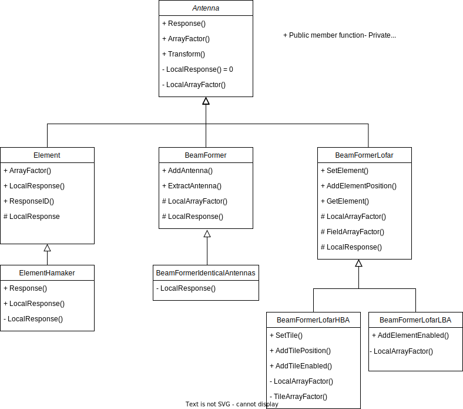

Phased array station hierarchy
==============================

EveryBeam was primarily designed to compute the beam response for phased array telescopes. Such telescopes typically consist
of a collection of individual (dipole) antennas, that can be grouped into several layers of (nested) beamformers.
As a result, developers that are new to EveryBeam may face a somewhat steep learning curve. This page aims to provide some motivation and
insight in the (phased array) structure of EveryBeam, and is hopefully useful for developers to get
acquainted with these core concepts in EveryBeam.

For the documentation of the class and function signatures, reference is made to the :ref:`cppinterface` page, and the :ref:`beamformers` page in particular.

Terminology
~~~~~~~~~~~

To make sense of EveryBeam, it is helpful to first introduce some EveryBeam terminology:

- **Telescope**: a radio astronomical telescope, supported by EveryBeam. In the scope of this page: a phased array telescope, inheriting from the ``PhasedArray`` class in EveryBeam.
- **Station**: an individual station within the telescope. For an interactive map of the LOFAR stations, see https://www.astron.nl/lofartools/lofarmap.html .
- **Antenna**: the generic and abstract concept behind both an Element and a Beamformer in the phased array hierarchy. Typical to an Antenna is that it can return a ``Response`` (a Jones matrix) and an ``ArrayFactor`` (also a Jones matrix).
- **Element**: the smallest entity within a station (often the actual dipole antenna). It inherits from ``Antenna`` and can return a ``Response``, that is evaluated given a prescribed response model, and an ``ArrayFactor`` that is unity.
- **Beamformer**: contains a list of antennas - be it other beamformers or elements. Its ``Response`` is typically the weighted aggregated and coordinate transformed response of the underlying antennas. The ``ArrayFactor`` for a ``Beamformer`` is computed from the local ``LocalArrayFactor`` of the antennas that are collected in the ``Beamformer``.

Station, element, and everything in between
~~~~~~~~~~~~~~~~~~~~~~~~~~~~~~~~~~~~~~~~~~~

Phased array telescopes typically consist of a number of stations. These stations consist of a number of antennas, in turn. The signals of the antennas are combined by a beamformer.
That sounds like a pretty flat hierarchy, but alas, things are slightly more complex. This is because
the antennas can in turn be beamformers themselves, creating a nested hierarchy of beamformers.
This nesting procedure can in theory continue indefinitely, but in practice a station
usually employs just one or two beamforming levels. At the lowest level the station
consists entirely of elements.

EveryBeam makes no *a priori* assumptions on the number of beam former levels within a station, however. Probably, much of the complexity
in EveryBeam owes to this fact. It therefore might be illustrative to consider the hierarchy from a station at the highest
level to an element at the lowest level for LOFAR LBA and LOFAR HBA:

**LOFAR LBA:**

1. Station: typically having the post-fix ``LBA`` in their name, e.g. ``CS302LBA``;
2. Top level ``Beamformer``;
3. LOFAR field ``Beamformer``, see the `MeasurementSet description for LOFAR <https://www.astron.nl/lofarwiki/lib/exe/fetch.php?media=public:documents:ms2_description_for_lofar_2.08.01.pdf>`_;
4. Element ``Beamformer``, containing all unique ``Elements`` in the generic case.

**LOFAR HBA:**

1. Station: typically having the post-fix ``HBA`` in their name, e.g. ``CS302HBA``;
2. Top level ``Beamformer``;
3. LOFAR field ``Beamformer``;
4. Tiles beam former, collects all HBA tiles into one ``Beamformer``;
5. Individual tile ``Beamformer``, collects the elements per tile.

It thus can be seen that LOFAR HBA contains one additional beam former level compared to LOFAR LBA.

Antenna hierarchy and optimization short-cuts
~~~~~~~~~~~~~~~~~~~~~~~~~~~~~~~~~~~~~~~~~~~~~

The generic structure of EveryBeam is sometimes at odds with computational efficiency. In order to overcome serious performance penalties,
EveryBeam provides a number of ``BeamFormer`` subclasses. This is further illustrated in the following diagram, in which
the inheritance tree is depicted for all the classes that inherit from the ``Antenna`` class. A short motivation/characteristic
for each class is given in the text that follows this diagram.

Again, reference is made to :ref:`beamformers` for a documentation of the class and member function signatures.

Antenna
-------
The parent class for both the ``Element`` and the ``BeamFormer`` class. Core member functions of this class are the
``ArrayFactor`` and the ``Response`` function. Both member functions are generic for all the ``BeamFormer`` classes.
The ``Element`` class overrides the ``ArrayFactor`` member function, and the ``ElementHamaker`` class overrides the
``Response`` function, for reasons that are highlighted below.

Element
-------
The smallest entity in the phased array chain. In the end, each phased array
will consist of a collection of elements. Overrides the ``ArrayFactor`` member function
for the simple reason the ``ArrayFactor`` is unity, by definition.

The ``ElementResponse`` data member is central to this class, pointing to the actual element response model that
should be used (e.g. Hamaker or LOBEs).

ElementHamaker
--------------
This subclass is motivated by avoiding a number of
coordinate transformations when computing the ``Response`` of an element, using Hamaker's model.

BeamFormer
----------
The main purpose of the ``BeamFormer`` class is computing the ``Response`` and ``ArrayFactor`` for a collection of
antennas - be it a collection of lower level beam formers, or a collection of elements. The ``BeamFormer`` class
provides a generic structure for this, but yields undesired overhead for a number of use cases.

BeamFormerIdenticalAntennas
---------------------------
Subclass of ``BeamFormer`` which may only contain antennas having an identical local response.
The ``LocalResponse`` member function in this class exploits this, by only evaluating the response for the
first antenna in the beam former, when computing the beam former response. This effectively eliminates
a loop over the antenna responses. Please note that the array factor contains a unique contribution of each antenna.

This class is typically used for LOFAR HBA tiles, and for the element beam former within SKA LOW.

BeamFormerLofar
---------------
The aim of this abstract class is providing an efficient beam response implementation for LOFAR observations
in case the Hamaker model is used. It is a direct subclass of the ``Antenna`` class, since
it shares hardly any functionality with the ``BeamFormer`` class, since various short-cuts are taken:

- It assumes that the element response is identical for each individual element in the element beam former. Hence, it contains only one ``Element``. The positions of the different elements are unique, however. So it stores a vector of element positions.
- It assumes the array factor can directly be inferred from the geometric response, thereby bypassing an additional weighting step.

BeamFormerLofarHBA
------------------
``BeamFormerLofarHBA`` implements ``BeamFormerLofar`` for LOFAR HBA. On top of the ``BeamFormerLofar`` assumptions, it assumes that only one tile and a unique position per tile needs to be stored.
Please note that this assumption effectively bypasses one beamformer level compared to the generic LOFAR HBA hierarchy.

BeamFormerLofarLBA
------------------
``BeamFormerLofarLBA`` implements ``BeamFormerLofar`` for LOFAR LBA. It provides
the implementation of the ``LocalArrayFactor`` member function, specific for LOFAR LBA.

Initialization workflow
~~~~~~~~~~~~~~~~~~~~~~~

The logic to determine which ``BeamFormer`` or ``Element`` types have to be created, is found in ``msreadutils.h`` and its corresponding implementation file.
The core function - ``ReadAllStations`` - is called when constructing a ``LOFAR`` or ``OSKAR`` telescope object.
The flow diagram below highlights the initialization sequence, following a call to ``ReadSingleStation`` (click on the image to enlarge the view).

.. image:: ../_static/read_station.svg
  :width: 1000

